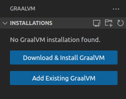

+++
date = "2023-03-09T10:00:00-03:00"
title = "Profiling - Introdução com Java, VisualVM e VSCode"
categories = ["ferramentas"]
tags = ["programação","java", "profiler", "vscode", "visualvm", "debug"]
banner = "img/banners/visualvm_logo_big.webp"
+++

Neste artigo, vamos fazer uma introdução acerca da técnica de `profiling`. Esta técnica é uma forma de análise dinâmica do código, isto é, que verifica e recolhe informações do programa em tempo de execução.

Ela é muito importante, pois nos permite ter informações muito importantes sobre o nosso programa que as vezes são impossíveis de se perceber apenas lendo o código, como a quantidade de vezes que uma função é executada, quais funções que demoram mais para serem executadas, como a memória é utilizada internamente no código e etc.

Apesar de ser uma técnica importante e bastante útil, ela não é bastante difundida nos cursos para iniciantes e muitos desenvolvedores não sabem tirar proveito dessa ferramenta.

Dessa forma, aqui faremos uma breve explicação de como uma ferramenta de profiling funciona utilizando o Java e como ela nos auxilia a entregar um código de qualidade ao final do processo.

## Requisitos Mínimos

Para este artigo, irei utilizar apenas ferramentas open-source, dessa forma, você poderá reproduzir facilmente na tua máquina local:

- Linux. Irei utilizar o Ubuntu 22.04, mas estes processos funcionam em outras distribuições e sistemas operacionais, porém os comandos no terminal poderão ser diferentes dos utilizados aqui.

- [VSCode](https://code.visualstudio.com/). Um editor de textos open-source.

- Java 17
  - No Ubuntu 22.04, para instalá-lo, basta utilizar o comando: `sudo apt install openjdk-17-jdk`

- Qualquer programa de terminal a tua escolha.

## Configurando o VSCode

### GraalVM

Antes de adicionarmos os plugins no VSCode, devemos instalar o GraalVM, porque ele é necessário para utilizarmos o plugin que possui a ferramenta de profiling que iremos utilizar: o VisualVM.

Os passos para instalar o GraalVM no Ubuntu 22.04 são esses:

1. Baixar o arquivo contendo o GraalVM dentro da [página de releases](https://github.com/graalvm/graalvm-ce-builds/releases) que eles possuem no Github.
   1. Lembrem-se de escolher a opção que corresponde a JVM que possui em teu computador, o sistema operacional e a arquitetura. No meu caso, como estou utilizando Java 17 e o Ubuntu 22.04, fiz o download da versão **Linux(amd64)** na coluna **Java 17**

1. Descompactar o arquivo baixado dentro da pasta `Documentos` no teu computador.

## Plugin do VSCode

Pronto, agora que baixamos a pasta do GraalVM, vamos adicionar o plugin necessário no VSCode e configurá-lo:

1. Na parte lateral direita do teu editor, vá no ícone para instalar as extensões, que se parece como uma peça do jogo do Tetris:

2. Na barra de pesquisa, digite **GraalVM Tools for Java** e faça a instalação deste plugin.

3. Ao instalar esse plugin, na barra direita do teu editor irá aparecer um ícone com as letras **Gr**. Clique nele.

4. Ao clicar no ícone do plugin, ele pedirá na parte de cima para fazer o Download e Instalação do GraalVM ou escolher uma existente. Selecione a segunda opção e escolha a pasta do GraalVM que descompactou na pasta de **Documentos** na seção anterior.

5. Agora, precisamos instalar o componente do VisualVM, que é a ferramenta de profiler que iremos utilizar, basta expandir a opção do GraalVM que você adicionou no plugin e clicar para instalar o componente do VisualVM como na imagem abaixo:

6. Pronto, ao fim da instalação do componente, você deve ver uma seção chamada **VisualVM** na parte inferior da aba do plugin com algumas opções *Process*, *CPU sampler*, *JFR* e etc.

7. Ao clicar no botão de executar o VisualVM, ele deverá abrir o programa de profiling, que possui esta estética:

Pronto, agora que configuramos e instalamos todas as ferramentas necessárias, podemos seguir com os passos seguintes, que é a criação do programa em Java que utilizaremos para testar a ferramenta de profiling e o uso dela efetivamente!